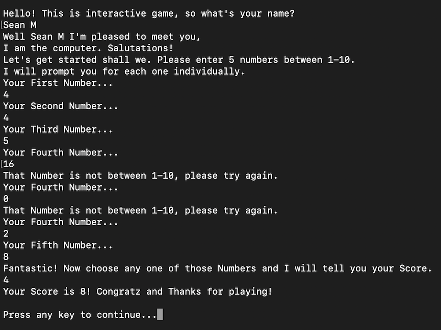

# Prework-CodeChallenges
CF 401d6 prework coding challenges 

### Problem 1: Array Max Result

#Problem Statement
Given an array select a number that exists, and output the computated "score". The method you create should take in both an array of integers and the integer the user selected.

Create a Console application that requests 5 numbers between 1-10. Output the array to the console and Ask the user to select a number. After the selection, output the "score" of the number chosen.

##Output Image

